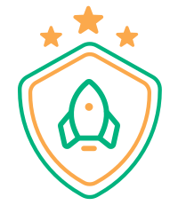

<p align="center">
  
  
  <h1 align="center">Ignite Teams</h1>

  <!-- <p align="center">
    🔗 <a href="https://URLThisProject.com">https://URLThisProject.com</a> 🔗
  </p>   -->

I developed the Ignite Teams project in React Native, where the creation of classes was developed and within them the creation of teams where people can be placed within each team.

</p>

## 🧭 Table of contents

- [🧭 Table of contents](#-table-of-contents)
- [🎨 Layout](#-layout)
- [👏 Learning and more Implementations](#-learning-and-more-implementations)
- [💡 Technologies Used](#-technologies-used)
- [📂 Folder Structure](#-folder-structure)
- [🚀 Running the Project](#-running-the-project)
  - [Mobile](#mobile)
- [🌎 License](#-license)
- [✒ Author](#-author)

## 🎥 Implementation Video


https://user-images.githubusercontent.com/40831841/221297886-8f52b7b5-f79d-4a9a-add9-6d1f41706ede.mp4


## 🎨 Layout

Layout developed by [Rodrigo Gonçalves ](https://www.linkedin.com/in/rodrigo-goncalves-santana/) and [Millena Kupsinskü Martins](https://www.linkedin.com/in/millenakmartins/)

[](<https://www.figma.com/file/cQr1IePDFPNHAhwLMLAyjq/Ignite-Teams-(Community)?node-id=102%3A375&t=geNzrHzNT2UmxSHM-1>)

## 👏 Learning and more Implementations

- Implemented theme creation.
- Implemented the application's routes.
- Implemented saving data in the cellphone storage.

## 💡 Technologies Used

- [x] [Expo](https://docs.expo.dev/)
- [x] [React Native](https://reactnative.dev/) `version: "0.70.5"`
- [x] [TypeScript](https://www.typescriptlang.org/)
- [x] [Phosphor Icons](https://github.com/duongdev/phosphor-react-native)
- [x] [Styled Components](https://styled-components.com/)
- [x] [SafeAreaContext](https://docs.expo.dev/versions/latest/sdk/safe-area-context/)
- [x] [React Navigation](https://reactnavigation.org/)
- [x] [AsyncStorage](https://docs.expo.dev/versions/latest/sdk/async-storage/)

## 📂 Folder Structure

```plainText
app
.
├── assets                      # Images for expo
├── src                         # Source files
│   ├── @types                  # Contains all global definitions of types and interfaces
│   ├── assets                  # Contains Js bundles assets. e.g: icons, splash, images etc...
│   ├── components              # Contains all global react components
│   ├── routes                  # Contains application routes
│   ├── screens                 # Contains application screens
│   ├── storage                 # Contains saving data in locations.
│   ├── theme                   # Contains the theme of the application
│   ├── utils                   # Contains useful classes and functions
.
.
├── App.tsx                     # Bundle entry
.
.
└── README.md
```

## 🚀 Running the Project

<!-- ### Back-end

Clone the project

```bash
  git clone https://link-para-o-projeto
```

Enter the project directory

```bash
  cd my-project
```

Install with dependencies

```bash
  npm install
```

Start the server

```bash
  npm run start
```

### Front-end Web

Clone the project

```bash
  git clone https://link-para-o-projeto
```

Enter the project directory

```bash
  cd my-project
```

Install with dependencies

```bash
  npm install
```

Start the server

```bash
  npm run start
``` -->

### Mobile

Clone the project

```bash
  git clone https://github.com/VagnerNerves/igniteteams.git
```

Enter the project directory

```bash
  cd igniteteams
```

Install with dependencies

```bash
  npm i
```

Start the server

```bash
  npx expo start
```

<!-- ## 📝 Routes

[](https://app.getpostman.com/run-collection/link)
[](https://insomnia.rest/run/?label=NAMEPROJECT&uri=LINK) -->

## 🌎 License

This project is under the MIT license. See the [LICENSE](https://github.com/VagnerNerves/igniteteams/blob/master/LICENSE) file for more details.

## ✒ Author

<p align="center">
  

  <h3 align="center">Vagner Nerves</h3>

  <p align="center">
    Made with love and hate 😅, get in touch!
  </p>
</p>

<div align="center">

[](https://www.linkedin.com/in/vagnernervessantos/)
[](mailto:vagnernervessantos@gmail.com)
[](https://github.com/VagnerNerves)

</div>
